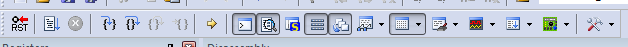
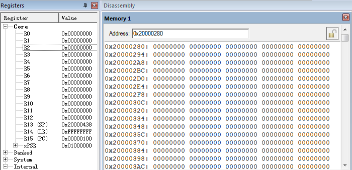
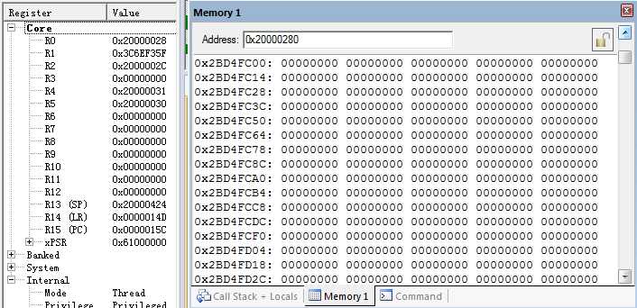

                                      Lab5: 安装ROS
##一.实验步骤

1.配置Ubuntu存储库，使其允许 "restricted" "universe" 和 "multiverse." 

  

2.建立你的sourse.list

  `$ sudo sh -c 'echo "deb http://packages.ros.org/ros/ubuntu $(lsb_release -sc) main" > /etc/apt/sources.list.d/ros-latest.list'`

  

3.设定密码

   `$  sudo apt-key adv --keyserver hkp://ha.pool.sks-keyservers.net:80 --recv-key 0xB01FA116`

  

4.安装

  首先确保Debian包索引是最新的:

  `$ sudo apt-get update`

  

  选择安装所有内容(推荐方式):

  `$ sudo apt-get install ros-kinetic-desktop-full`
  
  
  
  寻找可用的包:

  `$ apt-cache search ros-kinetic`

5.在使用ROS之前,初始化rosdep

   `$ sudo rosdep init`

   `$ rosdep update`

   

6.设置环境,每次启动一个新的shell的时候ROS环境变量会自动地添加到bash session

  `$ echo "source /opt/ros/kinetic/setup.bash" >> ~/.bashrc`

  `$ source ~/.bashrc`

  

7.获取rosinstall

  安装rosinstall:

  `$ sudo apt-get install python-rosinstall`

  

##二.实验感想

  本次实验是ROS的安装，基本上按照官网的安装步骤走，比较简单，主要是熟悉了一下ROS，一套框架，底层提供硬件驱动，软件层面支持通用的文件格式，我们以后主要会用它的仿真功能
