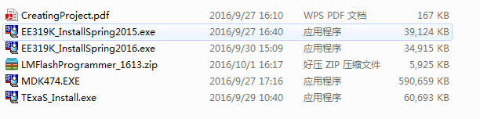
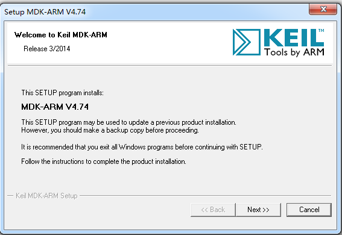

                                      Lab1: DOL开发环境配置
##一.实验步骤
1. ###安装必要的环境
    
     `$ sudo apt-get update` 

     `$  sudo apt-get install ant`

     `$ 	sudo apt-get install openjdk-7-jdk`

     `$	sudo apt-get install unzip`

2. ###解压文件

      新建dol的文件夹 

      `$	mkdir dol`

      将dolethz.zip解压到 dol文件夹中

      `$	unzip dol_ethz.zip -d dol`
 
      解压systemc

      `$	tar -zxvf systemc-2.3.1.tgz`

3. ###编译systemc
     解压后进入systemc-2.3.1的目录下

     `$	 cd systemc-2.3.1`

     新建一个临时文件夹objdir

     `$	 mkdir objdir`

     进入该文件夹objdir

     `$	 cd objdir`

     运行configure(能根据系统的环境设置一下参数，用于编译)

     `$	 ../configure CXX=g++ --disable-async-updates`
      
      下图为运行configure之后的截图:

      

      编译
      `$	sudo make install`

      编译完后文件目录如下($ cd ..        $ ls:    

      

 
      记录当前的工作路径:

      
      
4. ###编译dol
  
       `$	ant -f build_zip.xml all`

       

       运行第一个例子

       进入build/bin/mian路径下:
     
       `$ cd build/bin/main`

       `ant -f runexample.xml -Dnumber=1`

       成功结果如下图:

       

##  二.实验心得

   
   这次实验是关于DOL配置的过程,主要还是考察细心吧,在实验时有命令打少一个字母,搞得自己

   又不知道原因浪费了太多太多时间,不过学到的东西还挺多的,这是我第一次使用MarkDown这个
 
   工具,感觉挺好玩的,布局这些真的排得很好,期待接下来更多的实验.
      