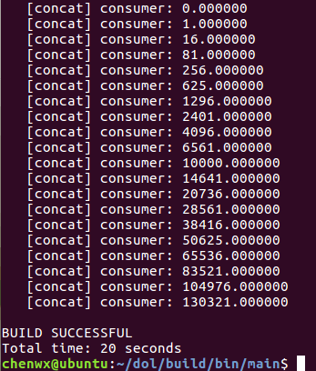
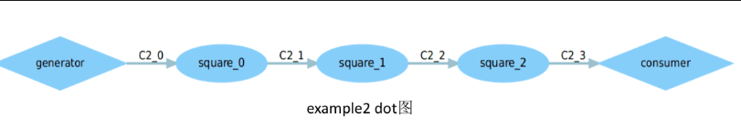
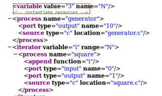
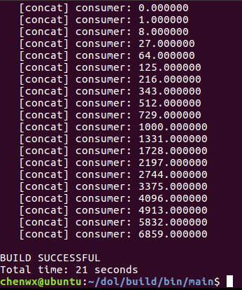
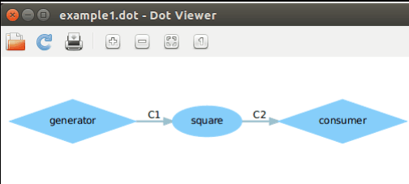
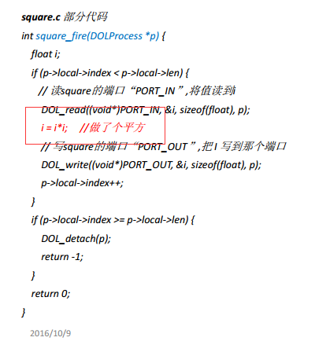

                                  Lab2: DOL实例分析&编程
##任务一:
###修改example2，让3个square模块变成2个, tips:修改xml的iterator
###实验结果:
####example2运行结果截图:

####改完的example2 dot截图:

####修改方法:因为题目要求的是将模块从3个变成两个,也就是说,相同的算法,只需要由三次迭代减少带两次迭代即可,所以我们可以找到xml中的iterator模块,找出迭代次数的代码,进行相应改变即可,如下图所示,要将"3"改成"2";

##任务二:
###修改example1，使其输出3次方数， tips:修改square.c
###实验结果:
####example1运行结果截图:

####改完的example1 dot截图:

####修改方法:因为题目要求的是输出三次方数,也就是说,要改变算法,我们可以找到square.c,发现数字传到里面进行了i*i的算法操作,所以说要满足题目的要求,需要把这一部分改成i*i*i;

##实验感想

####通过这次实验,我了解到了生产者,消费者,模块处理的功能定义以及系统架构即模块连接方式定义.我觉得这种定义非常快捷方便,例如说迭代次数,并不需要建立多个相同的运算模块,而是仅仅需要多条connection进行两两端口的连接,就可以实现多次迭代.

