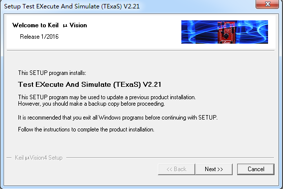

                                    Lab4: 死锁
###死锁实验进行步骤:
   1. 首先,将Class A,Class B,以及Deadlock.java保存在一个文件夹里

   2. 然后编译Deadlock.java代码:

    `javac Deadlock.java`	

   3. 双击Deadlock.bat文件,观察运行结果.

###死锁截图: 

    

   可以看到,死锁停在了第49次

###死锁的四个必要条件 
    * 互斥条件：一个资源每次只能被一个进程使用。
    * 占有且等待：一个进程因请求资源而阻塞时，对已获得的资源保持不放。
    * 不可强行占有:进程已获得的资源，在末使用完之前，不能强行剥夺。
    * 循环等待条件:若干进程之间形成一种头尾相接的循环等待资源关系。
这四个条件是死锁的必要条件，只要系统发生死锁，这些条件必然成立，而只要上述条件之
一不满足，就不会发生死锁。

###分析程序产生死锁的原因
首先,先看看Class A 和Class B的定义:

   

  可以看到,在类A里面,有一个MethodA函数,调用了b.last函数,有一个last函数,输入字符串"A",

  同样的,在类B里面,有一个MethodB函数,调用了a.last函数,有一个last函数,输入字符串"B",

  最重要的是函数前的"synchronized",它规定了当一个线程访问object的一个synchronized同步代码块或同步方法时，其他线程对object中所有其它synchronized同步代码块或同步方法的访问将被阻塞。好,现在看看DeadLock.java函数,看看是什么东西导致了死锁:

   

  这里定义了类A的对象a,类B的对象b,然后定义一个count=20000,执行t.start()函数,这时,系统就
会自动执行run()函数,调用了类B里面的MethodB函数,执行a.last()函数.然后,一旦while(count-->0)执行结束(执行过程可以看成是等待的环节),就会调用了类A里面的MethodA函数,执行b.last()函数.现在问题就在于,如果要调用b.last()函数,而methodB()函数因为正在执行,所以会阻塞掉这个请求.并且同时,如果上个程序要调用a.last(),因为现在的程序占有且等待,所以就会导致"都在等"的情况,这就是死锁.

 